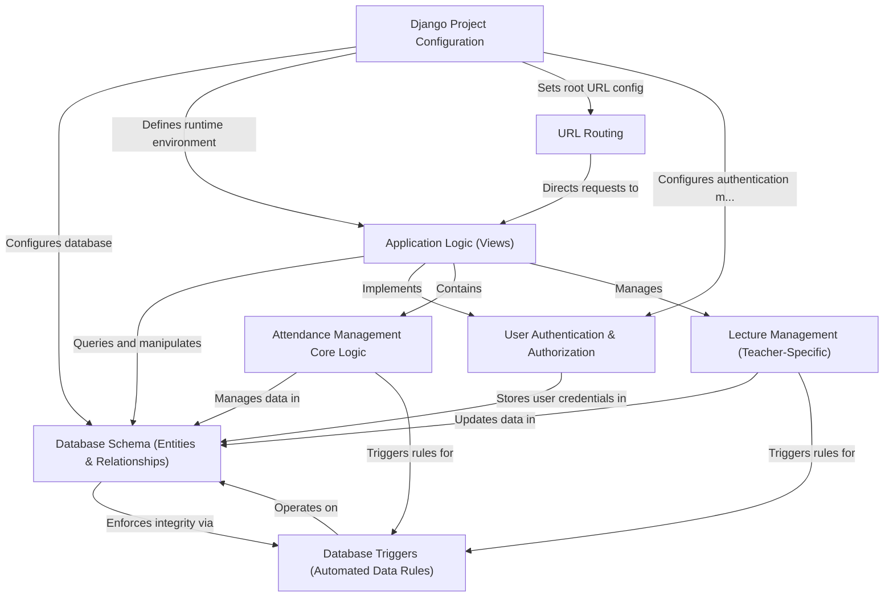

# Attendance-Management-System

The **Attendance-Management-System** is a web application built with Django that facilitates attendance tracking for educational institutions. It allows *administrators* to manage students, teachers, and courses; *teachers* to schedule and manage lectures and view student attendance; and *students* to mark their attendance for live lectures, often with location validation, and review their attendance records. The system focuses on maintaining accurate attendance data and ensuring efficient class management.

## Visual Overview

## Chapters

1. [Database Schema (Entities & Relationships)](readme_files/01_database_schema__entities___relationships__.md)
2. [User Authentication & Authorization](readme_files/02_user_authentication___authorization_.md)
3. [Attendance Management Core Logic](readme_files/03_attendance_management_core_logic_.md)
4. [Lecture Management (Teacher-Specific)](readme_files/04_lecture_management__teacher_specific__.md)
5. [Application Logic (Views)](readme_files/05_application_logic__views__.md)
6. [URL Routing](readme_files/06_url_routing_.md)
7. [Django Project Configuration](readme_files/07_django_project_configuration_.md)
8. [Database Triggers (Automated Data Rules)](readme_files/08_database_triggers__automated_data_rules__.md)

---
© 2025 [Pandiarajan D](https://github.com/itz-me-pandian). Educational Purpose.