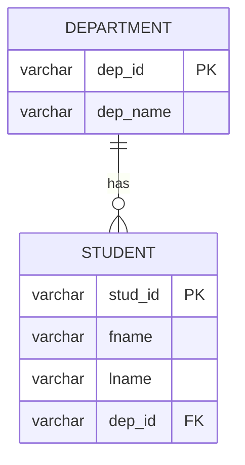
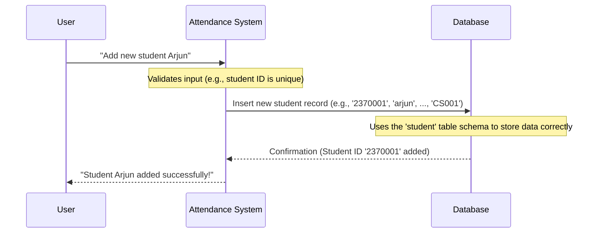

# Chapter 1: Database Schema (Entities & Relationships)

Welcome to the very first chapter of your journey into the Attendance Management System! Before we can build cool features like marking attendance or viewing student records, we need to understand how all the information in our system is organized and stored. Think of it like building a house – you need a detailed blueprint before you start laying bricks. This blueprint for our data is called the **Database Schema**.

## What Problem Are We Solving?

Imagine you have a big pile of papers: student names, teacher details, course schedules, attendance sheets, and so on. If you just throw them all into one box, finding anything later would be a nightmare!

Our Attendance Management System needs to store lots of different types of information:
*   Who are the **students**?
*   Who are the **teachers**?
*   What **courses** are being taught?
*   Which **lectures** happened and when?
*   Most importantly, who was **present** for which lecture?

The **Database Schema** helps us organize all this information neatly, so we can easily store it, find it, and use it later. It's the master plan for all the data that lives in our system.

## Key Concepts: Entities and Relationships

Let's break down this "Database Schema" into two core ideas:

### 1. Entities (The "Things" We Track)

In a database, "entities" are like the main categories of things or people you want to keep track of. Think of them as individual tables in a spreadsheet. Each table holds information about one specific type of entity.

For our Attendance Management System, here are some of our key entities:

*   **`student`**: Stores details about each student (like their ID, name, birthdate).
*   **`teacher`**: Stores details about each teacher (like their ID, name, email).
*   **`course`**: Stores details about each course (like course ID, name).
*   **`lecture`**: Stores details about specific class sessions (when and where a course was taught).
*   **`attendance`**: Records who was present for which lecture.
*   **`department`**: Groups students and teachers by their academic department.
*   **`admin_tab`**: Stores information for system administrators.

Each entity (table) has specific pieces of information called **attributes** (or columns). For example, the `student` entity might have attributes like `stud_id`, `fname` (first name), `lname` (last name), etc.

Let's look at a simple example of how the `student` entity is defined in our system:

```python
# Project/atp/models.py
from django.db import models

class student(models.Model):
    name = models.CharField(max_length=10)
    # ... more student details would go here
```
This Python code tells our system, "Hey, we have an entity called `student`, and each student will have a `name`." (In a full system, there would be many more details!). When this code runs, it creates a structure in our database.

Here's how that `student` entity might be defined directly in a database language (SQL):

```sql
-- inputs/table.sql (simplified)
create table student (
	stud_id varchar(10) constraint stpk primary key,
	fname varchar(30),
	lname varchar(30),
	minit varchar(10),
	dob date,
	dep_id varchar(10) constraint sd_fk references department(dep_id),
	barcode varchar(15)
);
```
This SQL code literally creates a table named `student`. It specifies that each student will have a `stud_id` (Student ID), `fname` (first name), `lname` (last name), and so on. The `stud_id` is a `primary key`, which means it's a unique identifier for each student – no two students can have the same `stud_id`!

### 2. Relationships (How Entities Connect)

Entities rarely exist in isolation. They are usually connected to each other. For example:
*   A `student` *belongs to* a `department`.
*   A `teacher` *teaches* a `course`.
*   An `attendance` record *links* a `student` to a `lecture`.

These connections are called **relationships**. They define how information flows and connects between different tables. We use special attributes called **foreign keys** to establish these links. A foreign key in one table "points" to a primary key in another table.

Let's visualize a simple relationship:


In this diagram:
*   `DEPARTMENT` and `STUDENT` are our entities (tables).
*   `dep_id` in `DEPARTMENT` is the `PK` (Primary Key) – it uniquely identifies each department.
*   `dep_id` in `STUDENT` is the `FK` (Foreign Key) – it links each student back to their department.
*   The line `DEPARTMENT ||--o{ STUDENT` means one department (`||`) can have many (`o{`) students.

## How Does This Solve Our Use Case? Storing Student Data

Let's say we want to add a new student, "Arjun Kumar," to our system, and he belongs to the "Computer Science" department. How does the schema help us?

1.  **Identify Entities**: We need to store information about a `student` and a `department`.
2.  **Understand Relationships**: A `student` *belongs to* a `department`. This means the `student` table will need to reference the `department` table.
3.  **Find the Right Tables**: We'll add a new record to the `student` table. The `student` table has a `dep_id` column which will hold the ID of Arjun's department.

Here's a simplified example of how data for a student is inserted into the `student` table:

```sql
-- inputs/input.sql (simplified)
REM inserting department records
insert into department values('CS001','Computer Science');

REM inserting student records
INSERT INTO student VALUES ('2370001', 'arjun', 'kumar', 'R', TO_DATE('2004-06-15', 'YYYY-MM-DD'), 'CS001', '9876543210');
```
In this example:
*   We first insert a row into the `department` table for 'CS001' (Computer Science).
*   Then, we insert a student record. Notice the `'CS001'` value in the student's record – this is the `dep_id` foreign key, linking Arjun to the "Computer Science" department.

**Output**: After these commands run, our database will have a new department and a new student record, correctly linked together!

## Internal Implementation: Adding a Student to the Database

When you or an admin uses the system to add a new student, here's a simplified sequence of what happens behind the scenes:



1.  **User Input**: Someone provides the student's details through a form in the Attendance System.
2.  **System Processing**: The Attendance System takes these details. It knows, from its internal setup (like the `models.py` file we saw), that this information belongs to the `student` entity.
3.  **Database Interaction**: The system then sends a command to the database to add a new record (a new row) to the `student` table. It uses the `stud_id` as the primary key and includes the `dep_id` to link the student to their department.
4.  **Database Stores**: The database uses the `create table student (...)` blueprint (schema) to make sure all the incoming data fits into the correct columns and follows any rules (like `stud_id` being unique).
5.  **Confirmation**: The database confirms back to the Attendance System that the record was successfully added.
6.  **User Feedback**: The system then shows a success message to the user.

This entire process relies on the database schema being clearly defined. Without it, the system wouldn't know what information to store, where to put it, or how different pieces of information relate to each other.

## Conclusion

In this chapter, we learned that the **Database Schema** is like the master blueprint for all the data in our Attendance Management System. It defines:
*   **Entities (Tables)**: The main categories of information we store (like `student`, `teacher`, `course`).
*   **Relationships**: How these entities are connected (e.g., a `student` belongs to a `department`), often using Primary and Foreign Keys.

Understanding this schema is fundamental because it forms the backbone of how our system organizes and manages all the attendance-related data. Everything else we build on top of this system will rely on this underlying structure.

Now that we know how data is stored, the next logical step is to understand how we control who can access and change this data. In the next chapter, we'll dive into [User Authentication & Authorization](02_user_authentication___authorization_.md).

---

 <sub><sup>**References**: [[1]](https://github.com/itz-me-pandian/Attendance-Management-System/blob/904ec3a6902ecfc89889f8f4ac3dfbb2dcd8e182/Project/atp/migrations/0001_initial.py), [[2]](https://github.com/itz-me-pandian/Attendance-Management-System/blob/904ec3a6902ecfc89889f8f4ac3dfbb2dcd8e182/Project/atp/models.py), [[3]](https://github.com/itz-me-pandian/Attendance-Management-System/blob/904ec3a6902ecfc89889f8f4ac3dfbb2dcd8e182/inputs/input.sql), [[4]](https://github.com/itz-me-pandian/Attendance-Management-System/blob/904ec3a6902ecfc89889f8f4ac3dfbb2dcd8e182/inputs/table.sql)</sup></sub>