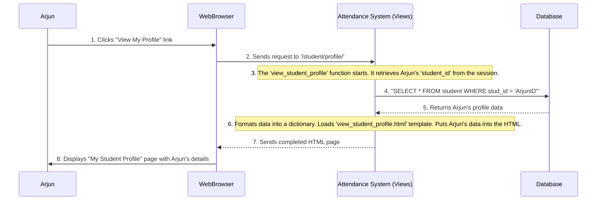

# Chapter 5: Application Logic (Views)

Welcome back! In [Chapter 4: Lecture Management (Teacher-Specific)](04_lecture_management__teacher_specific__.md), we saw how teachers can schedule, update, and delete lectures, ensuring smooth course delivery. We focused on the features that allow teachers to organize their classes.

Now, imagine our Attendance Management System is like a bustling restaurant. You, as the user, send an "order" (a request) to the kitchen (our application). But who takes your order, decides which chef (function) should cook it, gathers the ingredients (data from the database), prepares the dish (processes the request), and finally brings it to your table (sends back a webpage)?

This is precisely the job of the **Application Logic**, specifically what we call **"Views"** in our system. Views are the "brains" or the "chefs" that process incoming web requests and decide what to do with them.

## What Problem Are We Solving? Responding to User Actions!

Every time you click a button, fill out a form, or type a web address into your browser, you're sending a "request" to a web application. Our Attendance Management System needs a way to:
*   Receive these requests.
*   Understand what the user wants to do (e.g., "show my profile," "mark attendance," "add a lecture").
*   Perform the necessary actions (e.g., look up data in the database, calculate attendance, save new information).
*   Send back an appropriate response (e.g., a webpage with your profile, a success message, or an error page).

Views are the core Python functions that handle this entire process. They are the responsive heart of our application, making it interactive and useful for students, teachers, and admins.

## Key Concepts: Your Application's Response Team

Let's break down what "Application Logic (Views)" really means:

### 1. Views are Python Functions

At their simplest, views are just regular Python functions that live in a file like `views.py`. Each function is designed to handle a specific type of request.

```python
# Project/atp/views.py (Simplified)

def some_view_function(request):
    # This is a view! It receives a 'request' object.
    # It will do some work here...
    return HttpResponse("Hello from the view!")
```
**Explanation**:
*   `def some_view_function(request):`: This defines a function named `some_view_function`. The `request` parameter is super important – it's how the view gets all the information about what the user wants (like what button they clicked or what data they typed).
*   `return HttpResponse("Hello from the view!")`: This is how a view sends something back to the user's browser. `HttpResponse` just sends a plain text message. Often, views send back full HTML pages.

### 2. Views Process Requests

When your browser makes a request, the web server passes all the details of that request (like the URL, any form data, and who you are) to the correct view function. The view then "processes" this request.

### 3. Views Talk to the Database

Often, processing a request means getting or saving data. Views are the bridge between the user interface and our database. They use database commands (like `SELECT` or `INSERT`, as we saw in [Chapter 1: Database Schema (Entities & Relationships)](01_database_schema__entities___relationships__.md)) to interact with the stored information.

### 4. Views Return Responses

After doing its job, a view function must return something to the user. This is usually:
*   An HTML page (rendered using a template, like `student_dashboard.html`).
*   A redirect to another page.
*   A simple text message or data (like a JSON response).

## Use Case: A Student Wants to View Their Profile

Let's use a very common scenario: **Arjun (a student) has logged into the system and now wants to see his personal profile details.**

**Input**: Arjun clicks a "View My Profile" link on his student dashboard.
**Output**: A webpage displaying all of Arjun's stored information (ID, name, date of birth, etc.).

### Step 1: The User Interface (HTML Link)

After Arjun logs in, his student dashboard (`student_dashboard.html`) would likely have a link for viewing his profile.

```html
<!-- Project/atp/templates/atp/student_dashboard.html (simplified) -->
<body>
    <h2>Welcome, Student!</h2>
    <p>This is your dashboard.</p>
    <ul>
        <li><a href="">View My Profile</a></li>
        <!-- ... other student links ... -->
    </ul>
</body>
```
**Explanation**:
*   `<a href="">View My Profile</a>`: This is a standard HTML link. The `` part is a special Django tag that automatically generates the correct web address (URL) for the `view_student_profile` function in our `views.py` file. (We'll learn more about URL routing in [Chapter 6: URL Routing](06_url_routing_.md)).

### Step 2: The View Function (Processing the Request)

When Arjun clicks "View My Profile", his browser sends a request to our application. Our system is configured to route this request to the `view_student_profile` function in `views.py`. This function then does the work:

```python
# Project/atp/views.py (simplified - view_student_profile function)
from django.shortcuts import render
from django.db import connection

def view_student_profile(request):
    # 1. Get the logged-in student's ID from the session
    student_id = request.session.get('current_user') 

    # 2. If the student is logged in, fetch their data from the database
    if student_id:
        with connection.cursor() as cursor:
            # Execute an SQL query to get all details for this student ID
            cursor.execute("""
                SELECT stud_id, fname, lname, minit, dob, dep_id, barcode FROM student
                WHERE stud_id = %s
            """, [student_id])
            student_row = cursor.fetchone() # Get one row of data

        if student_row:
            # 3. Organize the fetched data into a dictionary
            student_data = {
                'stud_id': student_row[0],
                'fname': student_row[1],
                'lname': student_row[2],
                'minit': student_row[3],
                'dob': student_row[4],
                'dep_id': student_row[5],
                'barcode': student_row[6],
            }
            # 4. Render an HTML page, passing the student_data to it
            return render(request, 'atp/view_student_profile.html', student_data)
        else:
            return HttpResponse("Student data not found.", status=404)
    else:
        # If no student ID in session, they are not logged in
        return HttpResponse("Please log in to view your profile.", status=403)
```
**Explanation**:
1.  `student_id = request.session.get('current_user')`: This line gets the `stud_id` of the currently logged-in student. This `student_id` was saved in the user's "session" when they successfully logged in (as explained in [Chapter 2: User Authentication & Authorization](02_user_authentication___authorization_.md)).
2.  `with connection.cursor() as cursor:`: This opens a direct connection to our database.
3.  `cursor.execute(...)`: This runs a SQL `SELECT` query to retrieve all columns (`stud_id`, `fname`, etc.) from the `student` table where the `stud_id` matches the logged-in student's ID.
4.  `student_row = cursor.fetchone()`: This gets the result of the query. If a student is found, `student_row` will contain their details as a tuple (like a list of values).
5.  `student_data = {...}`: We then take the data from `student_row` and put it into a Python dictionary. This makes it easier to refer to the data by name (e.g., `student_data['fname']`) in our HTML.
6.  `return render(request, 'atp/view_student_profile.html', student_data)`: This is the view's "response." It tells Django to:
    *   Load the HTML file named `view_student_profile.html`.
    *   Pass the `student_data` dictionary to that HTML file, so the HTML can display the information.
    *   Send the fully prepared HTML page back to the user's browser.

### Step 3: The HTML Template (Displaying the Data)

The `view_student_profile.html` file receives the `student_data` from the view and uses special Django template tags to display it.

```html
<!-- Project/atp/templates/atp/view_student_profile.html (simplified) -->
<body>
    <h2>My Student Profile</h2>
    <p>Student ID: {{ stud_id }}</p>
    <p>Full Name: {{ fname }} {{ minit }} {{ lname }}</p>
    <p>Date of Birth: {{ dob }}</p>
    <p>Department ID: {{ dep_id }}</p>
    <p>Barcode: {{ barcode }}</p>
    <a href="" class="back-link">← Back to Dashboard</a>
</body>
```
**Explanation**:
*   `{{ stud_id }}`: These double curly braces are Django's way of saying, "Insert the value of the `stud_id` variable that the view function passed to me here." This allows dynamic content to be shown on the webpage.

## Internal Implementation: The Journey of a Request

Let's visualize the entire process from when Arjun clicks the link to when he sees his profile:



### Deeper Dive into `views.py`

The `view_student_profile` function is a great example, but all view functions in our `views.py` file follow a similar pattern:

1.  **Receive `request`**: Every view takes `request` as its first argument. This object holds everything about the current web request, including:
    *   `request.method`: Whether it's a `GET` (just asking for a page) or `POST` (submitting data).
    *   `request.POST`: A dictionary of data submitted through a form (e.g., username, password, lecture details).
    *   `request.session`: A way to store and retrieve data specific to the current user across different requests (like their `student_id` or `teacher_info` after login).
2.  **Process Logic**: This involves:
    *   **Retrieving data from `request`**: Using `request.POST.get('fieldname')` for form data or `request.session.get('key')` for session data.
    *   **Database Interactions**: Using `connection.cursor().execute()` to run SQL queries (`SELECT`, `INSERT`, `UPDATE`, `DELETE`) to get or save information. We saw this in action in [Chapter 3: Attendance Management Core Logic](03_attendance_management_core_logic_.md) for `add_attendance` and in [Chapter 4: Lecture Management (Teacher-Specific)](04_lecture_management__teacher_logic_.md) for `insert_lecture`.
    *   **Business Rules**: Performing calculations (like attendance percentages in `view_my_attendance`), validations (like checking lecture conflicts in `check_lecture_conflict`), or comparisons (like location-based attendance in `add_attendance`).
3.  **Return `HttpResponse`**: The view always finishes by returning an `HttpResponse` object (or a subclass like `render` or `redirect`).
    *   `render(request, 'template_name.html', context_data)`: This is the most common way to return an HTML page, injecting `context_data` (a dictionary of variables) into the `template_name.html`.
    *   `HttpResponse("Some text")`: Returns plain text.
    *   `JsonResponse(some_dict)`: Returns data formatted as JSON, often used for APIs.
    *   `redirect('url_name')`: Tells the browser to go to a different URL.

### Other Examples of Views in `views.py`:

Consider some other view functions we've already briefly touched upon:

*   **`admin_check(request)`**:
    *   **Input**: Admin ID and password from a login form.
    *   **Logic**: Queries the `admin_tab` in the database to verify credentials.
    *   **Output**: Renders `admin_dashboard.html` if successful, or an `HttpResponse` with an error if not.
*   **`add_attendance(request)`**:
    *   **Input**: Lecture ID, user's latitude and longitude from a form.
    *   **Logic**: Fetches lecture's actual location, compares it with user's, then `INSERT`s a new record into the `attendance` table.
    *   **Output**: `HttpResponse("Marked attendance successfully")` or an error.
*   **`insert_lecture(request)`**:
    *   **Input**: Course ID, date, start/end times, location from a form.
    *   **Logic**: Performs date/time validation, checks for scheduling conflicts with existing lectures for the teacher, then `INSERT`s into the `lecture` table.
    *   **Output**: `HttpResponse("Success! Lecture created...")` or an error.

As you can see, all these view functions are the "brains" behind different parts of our Attendance Management System. They define the specific actions our application can take in response to user input.

## Conclusion

In this chapter, we've understood the vital role of **Application Logic (Views)** in our Attendance Management System. Views are the Python functions that:
*   Receive user requests.
*   Act as the core "brains" to process those requests.
*   Interact with our database to fetch or save information.
*   Perform all the necessary business logic, validations, and calculations.
*   Finally, send back an appropriate response (usually a dynamic HTML page) to the user.

They are the central point where the user interface meets the database, making our application truly interactive. Now that we know what views are and what they do, the next logical step is to understand how our system knows *which* view to call for *which* request. In the next chapter, we'll learn about [URL Routing](06_url_routing_.md).

---


<sub><sup>**References**: [[1]](https://github.com/itz-me-pandian/Attendance-Management-System/blob/904ec3a6902ecfc89889f8f4ac3dfbb2dcd8e182/Project/atp/views.py)</sup></sub>
