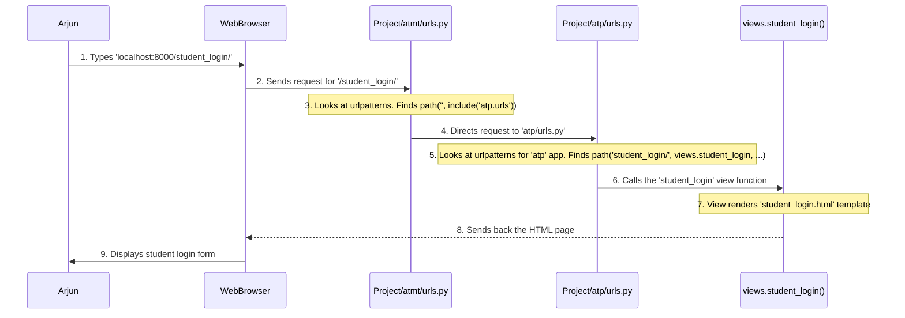

# Chapter 6: URL Routing

Welcome back! In [Chapter 5: Application Logic (Views)](05_application_logic__views__.md), we learned that **Views** are the Python functions that act as the "brains" of our application. They receive requests, do the work (like fetching data from the database), and send back responses (like displaying an HTML page).

Now, imagine our Attendance Management System is like a building with many different rooms, and each room has a specific "chef" (a View function) ready to prepare a different dish. When you, as a user, send an "order" (a web request), how does the system know *which* chef in *which* room should receive your order?

This is where **URL Routing** comes in! It's like the highly organized reception desk or internal mailroom of our application. Its job is to look at the web address (the URL) you've typed or clicked, and then direct your request to the *correct* View function that is designed to handle that specific address. Without URL routing, our application wouldn't know how to respond to your actions!

## What Problem Are We Solving? Finding the Right Door!

Every time you type something like `www.attendancesystem.com/student_login/` or click a link, your web browser sends a request to our server with that specific address (URL).

Our Attendance Management System needs a clear "map" or "directory" that says:
*   "If someone asks for `/student_login/`, send them to the `student_login` view function."
*   "If someone asks for `/teacher_dashboard/`, send them to the `teacher_dashboard` view function."
*   "If someone asks for `/mark_attendance/`, send them to the `mark_attendance` view function."

**URL Routing** provides this map. It's the mechanism that translates human-readable web addresses into calls to specific Python functions within our application, ensuring that the correct part of our system responds to what the user wants to do.

## Key Concepts: Building the Address Book

Let's break down the core ideas behind URL Routing. In Django (the web framework we're using), this is handled by special files called `urls.py`.

### 1. URLs are Web Addresses

A URL (Uniform Resource Locator) is simply the address you see in your browser's address bar, like `https://example.com/some_page/`. In our system, we care about the part after the main domain, like `/student_login/` or `/teacher_dashboard/`. These are called "paths" or "routes."

### 2. Routes Connect URLs to Views

In Django, we define a list of patterns (routes) that the system should look for. Each pattern is associated with a specific View function that should be executed when that URL is requested.

### 3. The `path()` Function

The core tool for defining routes is the `path()` function. It takes at least two main arguments:
*   The `route` (the URL pattern, like `'student_login/'`).
*   The `view` function that should handle this route (like `views.student_login`).

```python
# Simplified example of a route
from django.urls import path
from . import views # Import our view functions

urlpatterns = [
    path('student_login/', views.student_login, name='student_login'),
]
```
**Explanation**:
*   `path('student_login/', views.student_login, ...)`: This line says, "When the system receives a request for the path `/student_login/`, call the `student_login` function from our `views` module."

### 4. The `urlpatterns` List

All your `path()` definitions go into a Python list called `urlpatterns`. Django looks through this list, from top to bottom, to find a matching URL pattern.

### 5. Using `include()` for Organization

For larger applications (like ours!), having all routes in one giant `urls.py` file can get messy. Django lets us organize routes by "including" `urls.py` files from different parts (apps) of our project. Think of it like a main phone directory that directs you to smaller, specialized directories.

### 6. The `name` Parameter

The `name` parameter in `path()` (e.g., `name='student_login'`) is super useful! It gives a human-readable name to your route. Instead of hardcoding URLs in your HTML (`<a href="/student_login/">`), you can use this name (`<a href="">`). If you ever change the URL pattern later, you only need to change it in `urls.py`, and all your links will automatically update!

## Use Case: A Student Navigates to the Login Page

Let's use our example from [Chapter 5: Application Logic (Views)](05_application_logic__views__.md). **Arjun (a student) wants to go to the student login page by typing `/student_login/` in his browser.**

**Input**: Arjun types `http://localhost:8000/student_login/` (assuming our app is running locally) and presses Enter.
**Output**: The `student_login.html` page, showing him the login form.

### Step 1: The Browser Makes a Request

Arjun's browser sends a request for the `/student_login/` path to our Django application.

### Step 2: The Project's Main URL Configuration (`Project/atmt/urls.py`)

Every Django project has a main `urls.py` file (in our case, `Project/atmt/urls.py`). This file acts as the *master map*. It first checks if the URL matches any of its patterns. For application-specific URLs, it usually "includes" the `urls.py` file from our application (`atp` app).

```python
# Project/atmt/urls.py (simplified)
from django.contrib import admin
from django.urls import path, include # Import include!

urlpatterns = [
    path('admin/', admin.site.urls), # Admin site URLs
    path('', include('atp.urls')),   # Include URLs from our 'atp' app
]
```
**Explanation**:
*   `path('', include('atp.urls'))`: This is the crucial line. It says, "If the URL path doesn't start with `admin/` (and potentially other patterns), then look for matches within the `urls.py` file of the `atp` application." The empty string `''` means it matches the beginning of *any* remaining URL.

### Step 3: The Application's URL Configuration (`Project/atp/urls.py`)

Since `atmt/urls.py` directed the request to `atp.urls`, Django now looks inside `Project/atp/urls.py`. This is where the specific routing for our Attendance Management System's features lives.

```python
# Project/atp/urls.py (simplified snippet)
from django.urls import path
from . import views # Import our views module

urlpatterns = [
    # ... other paths ...
    path('student_login/', views.student_login, name='student_login'),
    # ... many more paths ...
]
```
**Explanation**:
*   `path('student_login/', views.student_login, name='student_login')`: This line perfectly matches Arjun's request for `/student_login/`. It tells Django to call the `student_login` function located in our `views.py` file. The `name='student_login'` gives this path a convenient label.

### Step 4: The View Function Executes (`Project/atp/views.py`)

As per the routing, the `student_login` view function (from `Project/atp/views.py`) is now called.

```python
# Project/atp/views.py (simplified snippet)
from django.shortcuts import render

def student_login(request):
    # This view doesn't need to do much initially, just show the form
    return render(request, 'atp/student_login.html')
```
**Explanation**:
*   This function simply renders (prepares and sends back) the HTML template `atp/student_login.html`. This is the login form that Arjun will see.

### Step 5: The Response is Sent Back

The `student_login.html` page is sent back to Arjun's browser, displaying the student login form.

## Internal Implementation: The Routing Journey

Let's visualize the journey of Arjun's request through our URL routing system:



### Deeper Dive into the `urls.py` Files

Let's look at the actual code from our project to see these concepts in action.

#### 1. The Project's `urls.py` (`Project/atmt/urls.py`)

```python
# Project/atmt/urls.py
from django.contrib import admin
from django.urls import path, include # Notice 'include' here!

urlpatterns = [
    path('admin/', admin.site.urls), # Routes for Django's built-in admin site
    path('',include('atp.urls')),   # Routes for our 'atp' application
]
```
**Explanation**:
*   `path('admin/', admin.site.urls)`: This line sets up all the routes for Django's powerful administration interface. When you go to `/admin/`, this is what handles it.
*   `path('',include('atp.urls'))`: This is key for our application. It tells Django, "For any request that hasn't been handled yet (that's what the empty string `''` means at the start of the path), go and look for more URL patterns inside the `urls.py` file located in our `atp` application." This keeps our main `urls.py` clean and organized!

#### 2. The Application's `urls.py` (`Project/atp/urls.py`)

This file contains all the specific routes for our Attendance Management System.

```python
# Project/atp/urls.py (selected snippets for clarity)
from django.urls import path
from . import views # We import all our view functions from views.py

urlpatterns = [
    path('', views.home, name='home'), # The very first page when you visit the root '/'
    path('register', views.register, name='reg'), # For the registration page
    # ... student-related login and dashboard routes ...
    path('student_login/', views.student_login, name='student_login'), # This is our example route!
    path('student_login/student_dashboard/', views.student_dashboard, name='student_dashboard'),
    path('student_login/student_dashboard/student_check', views.student_check, name ='student_check'),
    # ... teacher-related routes ...
    path('teacher_login/', views.teacher_login, name='teacher_login'),
    path('teacher_login/teacher_dashboard', views.teacher_dashboard, name='teacher_dashboard'),
    path('teacher_login/teacher_dashboard/teacher_check', views.teacher_check, name='teacher_check'),
    # ... more specific teacher actions ...
    path('teacher_login/teacher_dashboard/my_courses/add_lecture',views.add_lecture,name='add_lecture'),
    path('teacher_login/teacher_dashboard/insert_lecture',views.insert_lecture,name='insert_lecture'),
    # ... many more routes ...
]
```
**Explanation**:
*   `from . import views`: This line imports all the functions from our `views.py` file into this `urls.py` file, so we can refer to them (e.g., `views.home`, `views.student_login`).
*   Each `path(...)` line defines a specific route:
    *   `'student_login/'`: This is the exact path Django will try to match.
    *   `views.student_login`: This is the Python function that will be called if the path matches.
    *   `name='student_login'`: This is the unique nickname for this route, used in templates (e.g., ``).

### Why are `name`s so good?

Imagine we decided to change the student login URL from `/student_login/` to `/access/student/`.
*   **Without `name`s**: We'd have to manually find and update every single HTML link (e.g., `<a href="/student_login/">`) in all our template files. That's a huge pain and error-prone!
*   **With `name`s**: We only change the `urls.py` line:
    `path('access/student/', views.student_login, name='student_login'),`
    All our HTML links using `` will automatically generate the correct new URL (`/access/student/`) without any manual changes in the HTML! This makes our code much more maintainable.

## Conclusion

In this chapter, we've demystified **URL Routing**. We learned that it's the application's "receptionist," directing incoming web addresses (URLs) to the appropriate Python functions (Views) that are designed to handle them. We saw how `path()` definitions in `urlpatterns` lists in `urls.py` files (both at the project and application level, thanks to `include()`) create this vital map. Understanding URL routing is crucial because it's how users navigate our system and how their actions trigger our application's logic.

Now that we understand how requests are routed to the correct code, the next step is to explore the overall setup and configuration that makes our Django project run smoothly. In the next chapter, we'll dive into [Django Project Configuration](07_django_project_configuration_.md).

---


<sub><sup>**References**: [[1]](https://github.com/itz-me-pandian/Attendance-Management-System/blob/904ec3a6902ecfc89889f8f4ac3dfbb2dcd8e182/Project/atmt/urls.py), [[2]](https://github.com/itz-me-pandian/Attendance-Management-System/blob/904ec3a6902ecfc89889f8f4ac3dfbb2dcd8e182/Project/atp/urls.py)</sup></sub>
