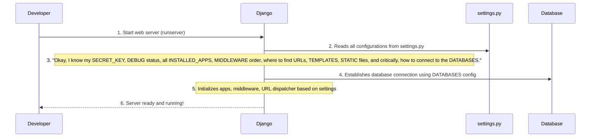

# Chapter 7: Django Project Configuration

Welcome back! In [Chapter 6: URL Routing](06_url_routing_.md), we learned how our Attendance Management System acts like a smart receptionist, directing incoming web requests (URLs) to the right "chef" (our Python View functions) to prepare a response. We saw how this map (`urls.py`) guides the flow of user actions.

Now, imagine our entire Attendance Management System as a large, complex restaurant. You have many chefs (Views), a receptionist (URL routing), and ingredients (the database). But who sets up the restaurant's *overall rules*? Who decides what kind of cuisine is served, what ingredients are always on hand, who gets a staff badge, and where the main kitchen is located?

This is exactly the role of **Django Project Configuration**. It's the central "management office" for your entire Django project. It defines the global rules, settings, and connections that make your web application run.

## What Problem Are We Solving? The Master Blueprint!

Every web application needs fundamental rules and settings to operate. Our Attendance Management System is no different. We need to tell Django things like:
*   "Which **database** should I use to store all the student, teacher, and attendance data?"
*   "What are all the different **mini-applications** (like our `atp` app, and Django's built-in features) that are part of this big project?"
*   "Are there any special **steps** I should take *every time* a user's request comes in, before passing it to a view?" (Like security checks or handling user sessions).
*   "Where do I find the **CSS, JavaScript, and images** (static files) for the website's look and feel?"

The **Django Project Configuration**, primarily managed in a file called `settings.py`, answers all these questions. It's the master blueprint that defines how the entire Django project is put together and how it behaves. Without it, Django wouldn't know how to connect to our Oracle database, find our `atp` application's code, or even handle a basic web request securely.

## Key Concepts: Inside the `settings.py` File

The core of our project's configuration lives in a file named `settings.py` (you can find it at `Project/atmt/settings.py`). Let's look at some of its most important sections:

### 1. `BASE_DIR`: Where Your Project Lives

This setting simply tells Django where the root (main folder) of your project is. It helps Django find other files relative to this location.

```python
# Project/atmt/settings.py (simplified)
from pathlib import Path

# Build paths inside the project like this: BASE_DIR / 'subdir'.
BASE_DIR = Path(__file__).resolve().parent.parent
```
**Explanation**: `BASE_DIR` is like the project's home address. All other file locations are often calculated from this starting point.

### 2. `SECRET_KEY`: Your Project's Security Code

This is a long, random string of characters used for cryptographic signing. It's vital for security (e.g., protecting user sessions). **Never share this in public, especially in production!**

```python
# Project/atmt/settings.py (simplified)
# SECURITY WARNING: keep the secret key used in production secret!
SECRET_KEY = "django-insecure-*@lez2@f044qi268he@_^-!8d@v%t6c8mh138nv&9tj0wfc5_6"
```
**Explanation**: Think of `SECRET_KEY` as a super-secret password for your entire application. It's used internally by Django to keep things safe.

### 3. `DEBUG`: Development Mode On/Off

`DEBUG = True` means you are in development mode. Django will show detailed error messages (very helpful for fixing bugs!) and won't require static files to be collected. **Always set `DEBUG = False` in a live, public application for security reasons.**

```python
# Project/atmt/settings.py (simplified)
# SECURITY WARNING: don't run with debug turned on in production!
DEBUG = True
```
**Explanation**: `DEBUG` is like a "developer mode" switch. When it's `True`, Django is more talkative about problems. When `False`, it's quieter and more secure.

### 4. `INSTALLED_APPS`: Registering Your Application's Features

This is a list of all the Django applications (including Django's own built-in tools and *your* custom apps like `atp`) that are active in your project. If you create a new app, you *must* add it here!

```python
# Project/atmt/settings.py (simplified)
INSTALLED_APPS = [
    "django.contrib.admin",        # Django's admin interface
    "django.contrib.auth",         # User authentication system
    "django.contrib.contenttypes", # Framework for content types
    "django.contrib.sessions",     # Session management (remembering logged-in users)
    "django.contrib.messages",     # Message framework (e.g., "Student added successfully!")
    "django.contrib.staticfiles",  # Static file management (CSS, JS, images)
    "atp",                         # Our custom Attendance Management App!
]
```
**Explanation**: `INSTALLED_APPS` is like a list of all the "modules" or "features" that your entire Django project uses. Our custom `atp` app needs to be on this list so Django knows about it.

### 5. `MIDDLEWARE`: Global Request Checkpoints

Middleware is a series of "hooks" or "checkpoints" that Django runs for *every single incoming request* and *every outgoing response*. They perform global functions like security checks, session management, and handling user authentication before a request even reaches your view.

```python
# Project/atmt/settings.py (simplified)
MIDDLEWARE = [
    "django.middleware.security.SecurityMiddleware",
    "django.contrib.sessions.middleware.SessionMiddleware",
    "django.middleware.common.CommonMiddleware",
    "django.middleware.csrf.CsrfViewMiddleware",
    "django.contrib.auth.middleware.AuthenticationMiddleware",
    "django.contrib.messages.middleware.MessageMiddleware",
    "django.middleware.clickjacking.XFrameOptionsMiddleware",
]
```
**Explanation**: Think of `MIDDLEWARE` as a security line or a series of administrative tasks that *every* customer (request) has to go through before they get to a chef (view).

Let's quickly look at what some of these do:

| Middleware                                     | What it does (Simplified)                                      |
| :--------------------------------------------- | :------------------------------------------------------------- |
| `SecurityMiddleware`                           | Adds various security protections to your site.                |
| `SessionMiddleware`                            | Enables Django's session framework to remember user data (like who is logged in). |
| `CommonMiddleware`                             | Does things like forbidding access to user agents specified in `DISALLOWED_USER_AGENTS`. |
| `CsrfViewMiddleware`                           | Protects against Cross-Site Request Forgery attacks (like the `` we saw). |
| `AuthenticationMiddleware`                     | Associates users with requests (figures out *who* the logged-in user is). |
| `MessageMiddleware`                            | Enables Django's message framework (e.g., temporary "success" messages). |
| `XFrameOptionsMiddleware`                      | Protects against clickjacking attacks.                         |

### 6. `ROOT_URLCONF`: The Main URL Map

This tells Django where to find the project's primary URL configuration file (the `urls.py` file we discussed in [Chapter 6: URL Routing](06_url_routing_.md)).

```python
# Project/atmt/settings.py (simplified)
ROOT_URLCONF = "atmt.urls"
```
**Explanation**: This is the address to the "master receptionist" (our main `urls.py` file).

### 7. `TEMPLATES`: Where to Find HTML Files

This section configures how Django finds and renders your HTML template files.

```python
# Project/atmt/settings.py (simplified)
TEMPLATES = [
    {
        "BACKEND": "django.template.backends.django.DjangoTemplates",
        "DIRS": [], # Additional directories to search for templates
        "APP_DIRS": True, # Tells Django to look for 'templates' folders inside each installed app
        # ... other options ...
    },
]
```
**Explanation**: `TEMPLATES` tells Django, "When a view calls `render()`, look for the HTML file in the `templates/` folder inside each of my `INSTALLED_APPS`." This is why our templates are in `Project/atp/templates/atp/`.

### 8. `DATABASES`: Connecting to Oracle!

This is one of the most critical parts! It defines how Django connects to your database. In our case, we're connecting to an **Oracle database**.

```python
# Project/atmt/settings.py (simplified)
DATABASES = {
    "default": {
        "ENGINE": "django.db.backends.oracle", # Specifies Oracle as the database type
        "NAME": 'localhost:1522/orcl1',        # Oracle connection string (host:port/service_name)
        "USER": 'system',                      # Database username
        "PASSWORD" : 'tiger',                  # Database password
    }
}
```
**Explanation**: `DATABASES` is like providing the specific address, username, and password to our "ingredient storage" (the Oracle database). Django uses this information (along with a special driver like `python-oracledb` or `cx_Oracle` which you'd install separately) to talk to the database. This is how all our SQL queries from [Chapter 1: Database Schema (Entities & Relationships)](01_database_schema__entities___relationships__.md) and our `views.py` functions (e.g., `cursor.execute(...)`) actually reach the Oracle database.

### 9. `STATIC_URL`: Managing Web Assets

This defines the URL where your static files (like CSS stylesheets, JavaScript files, and images) will be served from.

```python
# Project/atmt/settings.py (simplified)
STATIC_URL = "static/"
```
**Explanation**: `STATIC_URL` tells the web browser, "If you see `/static/`, look for CSS, JS, or images there." This helps organize the visual and interactive parts of your website.

## Solving Our Use Case: Database Connection and New App Registration

Let's see how `settings.py` directly solves problems like changing our database or adding new features.

### Use Case 1: Changing the Database Connection

Imagine our Oracle database server moves to a new address, or the password changes. How do we update our application to connect to the new location?

**Input**: The Oracle database address changes from `localhost:1521/orcl` to `localhost:1522/orcl1`, and the password remains `tiger`.

**Output**: Our Django application successfully connects to the new Oracle database.

**How `settings.py` solves it**:
You simply open `Project/atmt/settings.py` and modify the `DATABASES` section:

```python
# Project/atmt/settings.py (Before change)
DATABASES = {
    "default": {
        "ENGINE": "django.db.backends.oracle",
        "NAME": 'localhost:1521/orcl', # Old address
        "USER": 'system',
        "PASSWORD" : 'tiger',
    }
}
```
```python
# Project/atmt/settings.py (After change)
DATABASES = {
    "default": {
        "ENGINE": "django.db.backends.oracle",
        "NAME": 'localhost:1522/orcl1', # New address
        "USER": 'system',
        "PASSWORD" : 'tiger',
    }
}
```
**Explanation**: By changing the `NAME` (connection string) in `DATABASES`, we tell Django where to find the Oracle database. When Django starts up, it reads this updated configuration and uses the new connection details.

### Use Case 2: Registering a New Application

Suppose we create a brand new Django app within our project, maybe a `notifications` app to send alerts. How does Django know to include its models, views, and templates?

**Input**: A new Django app named `notifications` is created.

**Output**: Django recognizes and uses the `notifications` app as part of the project.

**How `settings.py` solves it**:
You simply add the name of your new app to the `INSTALLED_APPS` list:

```python
# Project/atmt/settings.py (Before adding new app)
INSTALLED_APPS = [
    # ... existing apps ...
    "atp",
]
```
```python
# Project/atmt/settings.py (After adding new app)
INSTALLED_APPS = [
    # ... existing apps ...
    "atp",
    "notifications", # <-- Add your new app here!
]
```
**Explanation**: Adding `"notifications",` to `INSTALLED_APPS` tells Django to find and load all the components (like models, views, and templates) that belong to the `notifications` app. Without this, Django would ignore your new app's code.

## Internal Implementation: Django's Setup Ritual

When you start your Django development server (`python manage.py runserver`), Django goes through a series of steps, and reading `settings.py` is one of the very first and most important ones.



**Deeper Dive into the Code (`settings.py` revisited)**

Let's quickly recap the key sections that orchestrate our project:

### `INSTALLED_APPS`

```python
# Project/atmt/settings.py
INSTALLED_APPS = [
    "django.contrib.admin",
    "django.contrib.auth",
    "django.contrib.contenttypes",
    "django.contrib.sessions",
    "django.contrib.messages",
    "django.contrib.staticfiles",
    "atp", # This is OUR attendance management application!
]
```
Our `atp` app is what contains all the custom code for our Attendance Management System. Registering it here means Django will:
*   Look for models (our entities like `student`, `teacher`, `lecture`) in `atp/models.py`.
*   Look for URL patterns in `atp/urls.py` (via `ROOT_URLCONF` and `include`).
*   Look for templates in `atp/templates/atp/`.
*   Include any admin configurations from `atp/admin.py`.

### `MIDDLEWARE`

```python
# Project/atmt/settings.py
MIDDLEWARE = [
    "django.middleware.security.SecurityMiddleware",
    "django.contrib.sessions.middleware.SessionMiddleware", # Manages user sessions (login status)
    "django.middleware.common.CommonMiddleware",
    "django.middleware.csrf.CsrfViewMiddleware",           # Protects our forms
    "django.contrib.auth.middleware.AuthenticationMiddleware", # Handles actual user login/logout
    "django.contrib.messages.middleware.MessageMiddleware",
    "django.middleware.clickjacking.XFrameOptionsMiddleware",
]
```
The order of middleware matters! For example, `SessionMiddleware` and `AuthenticationMiddleware` are critical for our [User Authentication & Authorization (Chapter 2)](02_user_authentication___authorization_.md). They make sure that when a user logs in, their session is remembered, and their identity is attached to every request, so our views know *who* is making the request. `CsrfViewMiddleware` ensures the security tokens in our forms are handled correctly.

### `DATABASES`

```python
# Project/atmt/settings.py
DATABASES = {
    "default": { # This names the database connection 'default'
        "ENGINE": "django.db.backends.oracle", # We are using Oracle
        "NAME": 'localhost:1522/orcl1',        # The Oracle TNS or connection string
        "USER": 'system',                      # Username for database access
        "PASSWORD" : 'tiger',                  # Password for database access
    }
}
```
This dictionary tells Django exactly how to connect to our Oracle database. The `ENGINE` specifies which database system (Oracle, PostgreSQL, MySQL, SQLite) to use, and `NAME`, `USER`, and `PASSWORD` provide the connection credentials. Without this, our views would not be able to run any of the SQL queries (`SELECT`, `INSERT`, `UPDATE`, `DELETE`) we've seen in previous chapters.

### `STATIC_URL`

```python
# Project/atmt/settings.py
STATIC_URL = "static/"
```
When our HTML templates (e.g., `student_dashboard.html`) include lines like `<link rel="stylesheet" href="">`, this `STATIC_URL` setting helps Django figure out that `css/style.css` should be found at `/static/css/style.css` when the page is served to the browser. This is how our application gets its styling and interactive elements.

## Conclusion

In this chapter, we've unlocked the "management office" of our project: **Django Project Configuration**, primarily found in `settings.py`. We learned that this file is the master blueprint, defining crucial aspects like:
*   Which **applications** (including our `atp` app) are active.
*   How to connect to our **Oracle database**.
*   The global **middleware** that handles common tasks for every request.
*   Where to find **URL patterns** and **HTML templates**.
*   How to manage **static files**.

Understanding `settings.py` is fundamental because it orchestrates how all the different pieces of our Attendance Management System work together. It's the core setup that allows our database schema, authentication logic, attendance processes, lecture management, view functions, and URL routing to operate as a cohesive web application.

Now that we've covered the entire software side of our system, from data organization to overall configuration, let's look at one final, powerful database feature that adds automated intelligence to our data: [Database Triggers (Automated Data Rules)](08_database_triggers__automated_data_rules__.md).

---


<sub><sup>**References**: [[1]](https://github.com/itz-me-pandian/Attendance-Management-System/blob/904ec3a6902ecfc89889f8f4ac3dfbb2dcd8e182/Project/atmt/asgi.py), [[2]](https://github.com/itz-me-pandian/Attendance-Management-System/blob/904ec3a6902ecfc89889f8f4ac3dfbb2dcd8e182/Project/atmt/settings.py), [[3]](https://github.com/itz-me-pandian/Attendance-Management-System/blob/904ec3a6902ecfc89889f8f4ac3dfbb2dcd8e182/Project/atmt/wsgi.py)</sup></sub>
