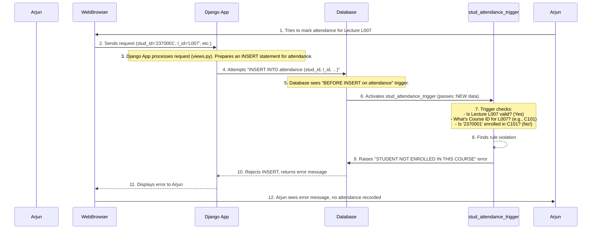
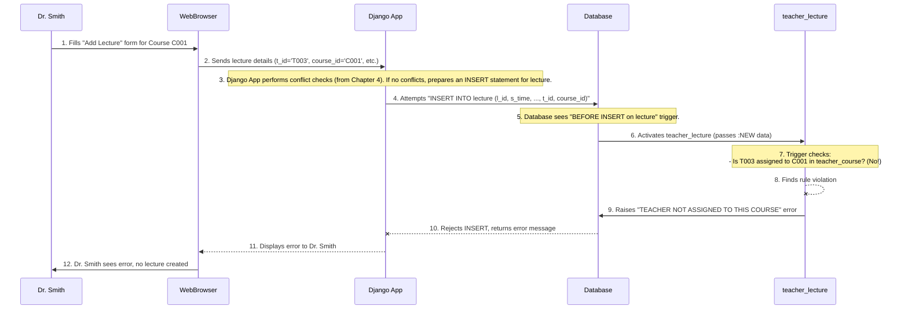

# Chapter 8: Database Triggers (Automated Data Rules)

Welcome back! In [Chapter 7: Django Project Configuration](07_django_project_configuration_.md), we wrapped up our exploration of the Attendance Management System's software side by looking at the master blueprint – the `settings.py` file – that orchestrates how all the different parts of our Django project work together.

Now, imagine that even with a perfect blueprint and well-defined rules in our application code, sometimes we still need an extra layer of "automated policing" *directly within the database itself*. What if some data tries to sneak in that breaks our fundamental rules, even if our application code missed it?

This is where **Database Triggers (Automated Data Rules)** come in. Think of them as vigilant security guards *inside* the database. They constantly watch for specific events (like someone trying to add new data) and, if those events happen, they automatically run a small piece of code to enforce a rule. If the rule is broken, they prevent the action from happening, ensuring our data stays clean and consistent.

## What Problem Are We Solving? The Database's Own Rules!

Our Attendance Management System has some crucial "business rules" that must *always* be followed, no matter what:

*   A **student can only mark attendance** for a course if they are actually **enrolled** in that course. It would be chaos if a student could mark attendance for any class!
*   A **teacher can only create a new lecture** for a course if they are actually **assigned to teach** that specific course. We don't want unauthorized teachers scheduling classes.
*   A **student cannot be enrolled in the same course twice**.

While our application's Python code in `views.py` (as seen in [Chapter 5: Application Logic (Views)](05_application_logic__views__.md)) tries its best to enforce these rules, what if there's a bug in the code, or what if someone tries to insert data directly into the database without going through our application?

**Database Triggers** solve this by creating rules that live *with the data itself*. They are special pieces of SQL code that run automatically whenever a specific event happens (like `INSERT`, `UPDATE`, or `DELETE`) on a particular table. This ensures critical business rules are *always* enforced, directly at the database level, maintaining **data integrity**.

## Key Concepts: Database Sentinels

Let's break down what database triggers are and how they work.

### 1. Triggers are Automated SQL Code

A trigger is a block of SQL code that is stored directly within the database. It's not part of your Python application; it's part of the database structure.

### 2. They Respond to Events

Triggers don't run on command. They are set up to respond to specific *events* that happen on a database table:
*   **`INSERT`**: When a new row of data is added to a table.
*   **`UPDATE`**: When an existing row of data is changed.
*   **`DELETE`**: When a row of data is removed from a table.

### 3. They Run "Before" or "After" an Event

You can specify *when* the trigger should run relative to the event:
*   **`BEFORE`**: The trigger runs *before* the database actually performs the `INSERT`, `UPDATE`, or `DELETE` operation. This is powerful because if the trigger finds a problem, it can stop the operation from happening! Most of our validation triggers will be `BEFORE` triggers.
*   **`AFTER`**: The trigger runs *after* the database has performed the operation. This is useful for things like logging changes or updating related tables.

### 4. They Operate "For Each Row"

Often, triggers are set up to run `FOR EACH ROW`. This means if you insert 10 new student records, the trigger will execute 10 times, once for each new record.

### 5. Accessing New and Old Data (`:NEW` and `:OLD`)

Inside a `FOR EACH ROW` trigger, you can refer to:
*   `:NEW`: The new data that is about to be (or just was) inserted or updated.
*   `:OLD`: The old data before it was updated or deleted.

This allows the trigger to compare values, validate them, or make decisions based on the changes.

### 6. Enforcing Business Rules and Data Integrity

The main purpose of triggers is to ensure **data integrity**. This means keeping your data accurate, consistent, and valid. They do this by enforcing rules that prevent invalid data from ever being stored. If a rule is broken, the trigger can "raise an application error," which stops the database operation and sends an error message back to the application.

## Use Case 1: Preventing Un-enrolled Attendance

Let's revisit a problem we touched upon in [Chapter 3: Attendance Management Core Logic](03_attendance_management_core_logic_.md). A student should *only* be able to mark attendance for a course they are actually enrolled in. Our `stud_attendance_trigger` ensures this.

**Input**: Arjun (student ID '2370001') tries to mark attendance for a lecture (e.g., `L007`) that belongs to a course he is *not* enrolled in.

**Output**: An error message "STUDENT NOT ENROLLED IN THIS COURSE" is returned, and the attendance record is **not** created in the database.

### The `stud_attendance_trigger` Code

Here's the simplified trigger code from our `inputs/trigger_for_inserting_attendance_row.sql` file that enforces this rule:

```sql
-- inputs/trigger_for_inserting_attendance_row.sql (simplified)
create or replace trigger stud_attendance_trigger
before insert on attendance
for each row
declare
    v_count NUMBER;
    c_count NUMBER;
    c_id course.course_id%type;
begin
    -- 1. Check if the lecture exists
    select count(*) into c_count from lecture where l_id=:NEW.l_id;
    if c_count = 0 then
        raise_application_error(-20001,'LECTURE DOES NOT EXIST');
    end if;

    -- 2. Get the course ID for the lecture
    select course_id into c_id from lecture where l_id=:NEW.l_id;

    -- 3. Check if the student is enrolled in that course
    select count(*) into v_count from student_course where stud_id=:NEW.stud_id and course_id=c_id;

    -- 4. If not enrolled, stop the operation with an error
    if v_count = 0 then
        RAISE_APPLICATION_ERROR(-20001, 'STUDENT NOT ENROLLED IN THIS COURSE');
    end if;
end;
/
```
**Explanation**:
1.  **`create or replace trigger stud_attendance_trigger`**: This creates or updates a trigger named `stud_attendance_trigger`.
2.  **`before insert on attendance`**: This tells the database to run this trigger *before* any new row is inserted into the `attendance` table.
3.  **`for each row`**: The trigger will run once for every row being inserted.
4.  **`l_id=:NEW.l_id` and `stud_id=:NEW.stud_id`**: The `:NEW` keyword allows the trigger to access the `l_id` (lecture ID) and `stud_id` (student ID) that are part of the new attendance record being inserted.
5.  **`select count(*) into c_count from lecture where l_id=:NEW.l_id;`**: First, it checks if the `l_id` the student is trying to mark attendance for actually exists as a valid lecture in the `lecture` table. If `c_count` is 0, the lecture doesn't exist, and the trigger `raise_application_error`.
6.  **`select course_id into c_id from lecture where l_id=:NEW.l_id;`**: If the lecture exists, the trigger gets the `course_id` associated with that lecture.
7.  **`select count(*) into v_count from student_course where stud_id=:NEW.stud_id and course_id=c_id;`**: Now, the crucial check! It counts how many times the `stud_id` (from the new attendance record) is linked to the `course_id` (of the lecture) in the `student_course` table.
8.  **`if v_count = 0 then RAISE_APPLICATION_ERROR(...)`**: If `v_count` is 0, it means the student is *not* enrolled in that course. The `RAISE_APPLICATION_ERROR` command stops the `INSERT` operation, prevents the attendance record from being saved, and sends the specified error message back to the application.

## Internal Implementation: Triggering an Error

Let's visualize what happens when Arjun tries to mark attendance for an un-enrolled course.



This sequence shows how the database trigger acts as an immediate gatekeeper, preventing invalid data from ever touching the `attendance` table, regardless of what the application attempts.

## Use Case 2: Ensuring Teacher-Course Assignment for Lectures

Another critical rule is that a teacher can only schedule lectures for a course they are actually assigned to teach. The `teacher_lecture` trigger enforces this. This was hinted at in [Chapter 4: Lecture Management (Teacher-Specific)](04_lecture_management__teacher_specific__.md).

**Input**: Dr. Smith (teacher ID `T003`) tries to add a new lecture for `C001` (DBMS), but he is *not* assigned to teach `C001` (he teaches `C002`).

**Output**: An error message "TEACHER NOT ASSIGNED TO THIS COURSE" is returned, and the lecture is **not** created.

### The `teacher_lecture` Trigger Code

Here's the simplified trigger code from `inputs/trigger_for_creating_lecture.sql`:

```sql
-- inputs/trigger_for_creating_lecture.sql (simplified)
CREATE OR REPLACE TRIGGER teacher_lecture
BEFORE INSERT ON lecture
FOR EACH ROW
DECLARE
    v_count NUMBER := 0;
BEGIN
    -- 1. Check if teacher is assigned to this course
    SELECT COUNT(*) INTO v_count
    FROM teacher_course
    WHERE t_id = :NEW.t_id
      AND course_id = :NEW.course_id;

    -- 2. If not assigned, stop the operation with an error
    IF v_count = 0 THEN
        RAISE_APPLICATION_ERROR(-20001, 'TEACHER NOT ASSIGNED TO THIS COURSE');
    END IF;
END;
/
```
**Explanation**:
1.  **`before insert on lecture`**: This trigger runs *before* any new lecture row is inserted into the `lecture` table.
2.  **`t_id = :NEW.t_id` and `course_id = :NEW.course_id`**: It accesses the `t_id` (teacher ID) and `course_id` (course ID) from the new lecture record being inserted.
3.  **`SELECT COUNT(*) INTO v_count FROM teacher_course WHERE t_id = :NEW.t_id AND course_id = :NEW.course_id;`**: This query checks the `teacher_course` table (which defines the assignments) to see if the teacher (`:NEW.t_id`) is linked to the course (`:NEW.course_id`).
4.  **`IF v_count = 0 THEN RAISE_APPLICATION_ERROR(...)`**: If no such link is found (`v_count` is 0), the teacher is not assigned to that course, and the `INSERT` operation is blocked with an error.

## Internal Implementation: Lecture Creation with Trigger Validation

Here's how this trigger integrates with the lecture creation process:



## Another Example: Preventing Duplicate Student Enrollment

Our project also includes a trigger to ensure that a student isn't accidentally enrolled in the same course multiple times.

```sql
-- inputs/trigger_for_teacher_student_link.sql (simplified)
create or replace NONEDITIONABLE trigger check_student_enrollment
before insert on student_course
for each row
declare
    v_teacher_count number;
    v_student_count number;
begin
    -- Check if the teacher is actually linked to this course (similar to teacher_lecture)
    select count(*) into v_teacher_count
    from teacher_course
    where t_id = :new.t_id
    and course_id = :new.course_id;

    -- Check if the student is already enrolled in this course
    select count(*) into v_student_count
    from student_course
    where stud_id = :new.stud_id
    and course_id = :new.course_id;

    if v_teacher_count = 0 then
        raise_application_error(-20001, 'teacher is not linked with this course');
    elsif v_student_count > 0 then
        -- This is the duplicate enrollment check!
        raise_application_error(-20002, 'student is already enrolled in this course');
    end if;
end;
/
```
**Explanation**:
*   This trigger runs `before insert on student_course`.
*   It checks `v_student_count`. If a record already exists for the `:new.stud_id` and `:new.course_id`, it means the student is already enrolled.
*   `raise_application_error(-20002, 'student is already enrolled in this course');` then prevents the duplicate enrollment.

This shows how multiple rules can be bundled into one or several triggers to reinforce different aspects of data integrity.

## Conclusion

In this chapter, we've explored the powerful concept of **Database Triggers (Automated Data Rules)**. We learned that these are specialized pieces of SQL code that reside directly within the Oracle database, acting as automated security guards. They automatically run in response to data modification events (`INSERT`, `UPDATE`, `DELETE`) on tables.

We saw how triggers like `stud_attendance_trigger`, `teacher_lecture`, and `check_student_enrollment` are crucial for:
*   Enforcing critical **business rules** (e.g., student must be enrolled in a course to mark attendance).
*   Preventing **invalid data** from ever being stored.
*   Maintaining the overall **data integrity** of our Attendance Management System.

Triggers provide a robust, database-level safety net, ensuring that even if application logic has a flaw, the fundamental rules governing our data are always upheld. They complete our understanding of how our Attendance Management System ensures its data is always reliable and accurate.

---

<sub><sup>**References**: [[1]](https://github.com/itz-me-pandian/Attendance-Management-System/blob/904ec3a6902ecfc89889f8f4ac3dfbb2dcd8e182/inputs/input.sql), [[2]](https://github.com/itz-me-pandian/Attendance-Management-System/blob/904ec3a6902ecfc89889f8f4ac3dfbb2dcd8e182/inputs/trigger_for_creating_lecture.sql), [[3]](https://github.com/itz-me-pandian/Attendance-Management-System/blob/904ec3a6902ecfc89889f8f4ac3dfbb2dcd8e182/inputs/trigger_for_inserting_attendance_row.sql), [[4]](https://github.com/itz-me-pandian/Attendance-Management-System/blob/904ec3a6902ecfc89889f8f4ac3dfbb2dcd8e182/inputs/trigger_for_teacher_student_link.sql)</sup></sub>

